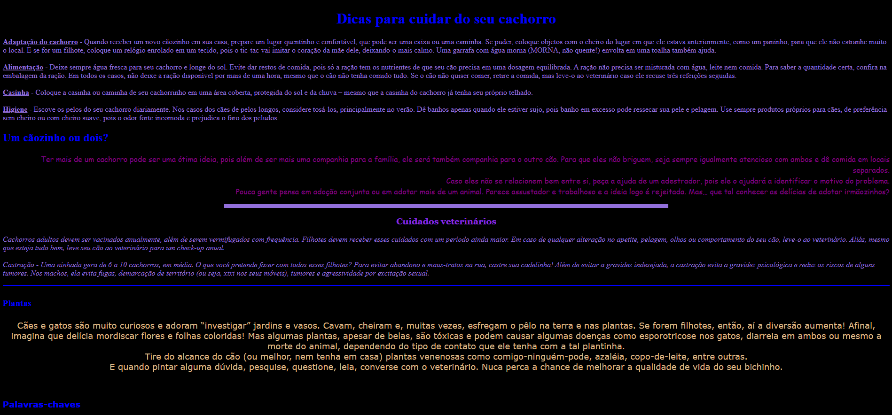
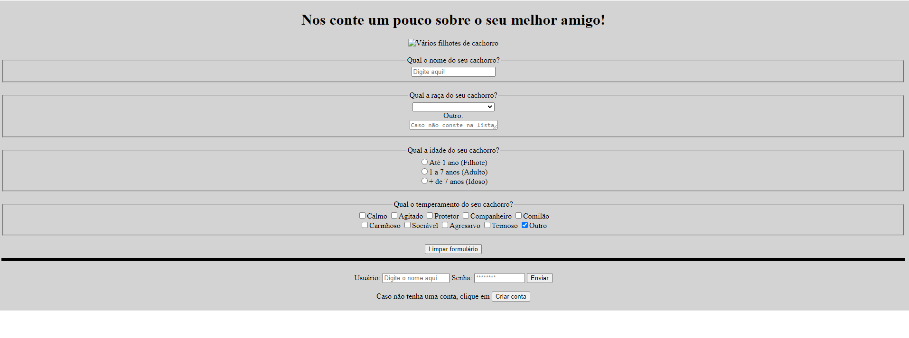
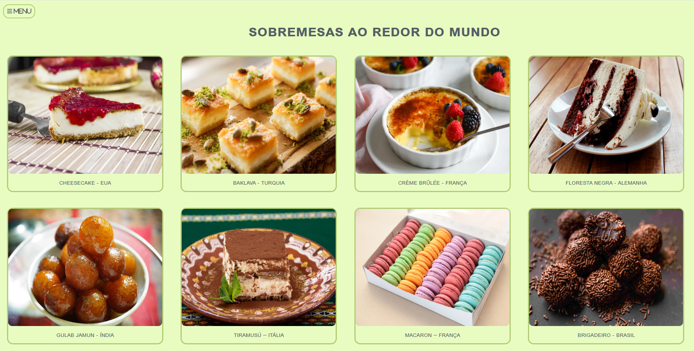

## Primeira tarefa
Foi para desenvolver um site de algum tema de meu interesse (escolhi cachorro) para aplicar os conhecimentos adquiridos até então, foram aplicadas diferentes fontes, cores, alinhamentos, títulos e etc, seguindo o padrão requerido na tarefa. Feito com HTML.

  

## Segunda tarefa
Foi para desenvolver um formulário de algum tema de meu interesse (novamente escolhi cachorro) aplicando os campos e suas variações (text, password, radio, checkbox, submit, reset, button, textarea, select), além de alguns elementos como name, size, value e etc. Feito com HMTL.

  

## Terceira tarefa
Foi para desenvolver um site com HTML de algum tema aleatório (escolhi doces populares pelo mundo) e estilizar com CSS. A quarta tarefa foi para incluir um menu no site já criado na terceira tarefa.

  

